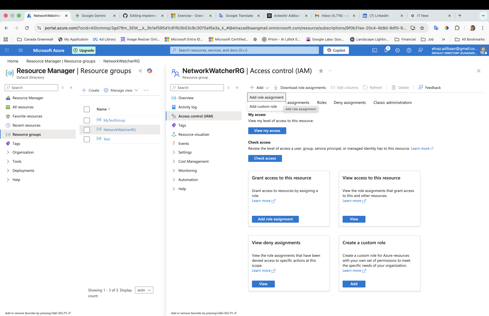
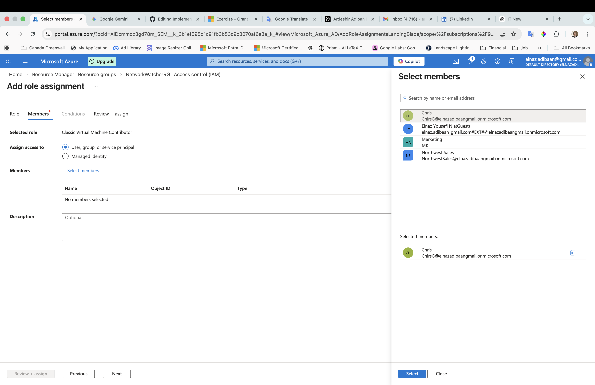

## Project: Implementing Least Privilege Access using Azure RBAC

### Introduction
As an **IT & Project Coordinator** at **Greenwall Companies**, I understand that security is paramount. This project demonstrates how to implement **Role-Based Access Control (RBAC)** to provide granular permissions at the Resource Group level.

### Scenario
The goal was to grant a specific user the **Virtual Machine Contributor** role, limited strictly to the **Network Watcher RG** resource group. This ensures the user can manage virtual machines without having administrative rights over the entire subscription or other sensitive resources.

### Visual Walkthrough
1. **Selecting the Scope:** Navigating to the **Network Watcher RG**.

2. **Assigning the Role:** Granting **Virtual Machine Contributor** permissions.

### Key Learning Outcomes
- **Scope Management:** Understanding how to apply roles at the Resource Group level.
- **Security Best Practices:** Implementing the principle of least privilege.
- **Identity Governance:** Utilizing Microsoft Entra ID identities for secure resource management.

- Conclusion
This project highlights the efficiency of Cloud Identity Management and security best practices within an Azure environment. By implementing Role-Based Access Control (RBAC) at the Resource Group level, I successfully demonstrated how to enforce the Principle of Least Privilege.

Key takeaways from this implementation include:

Enhanced Security: Restricting user permissions to specific resource groups (Network Watcher RG) prevents unauthorized administrative changes across the entire subscription.

Operational Efficiency: Using predefined roles like Virtual Machine Contributor allows team members to perform their necessary tasks without compromising broader environmental security.

Professional Growth: This project is a practical application of the concepts required for the AZ-104 (Microsoft Azure Administrator) certification and reflects my ongoing commitment to mastering cloud governance and infrastructure management.
